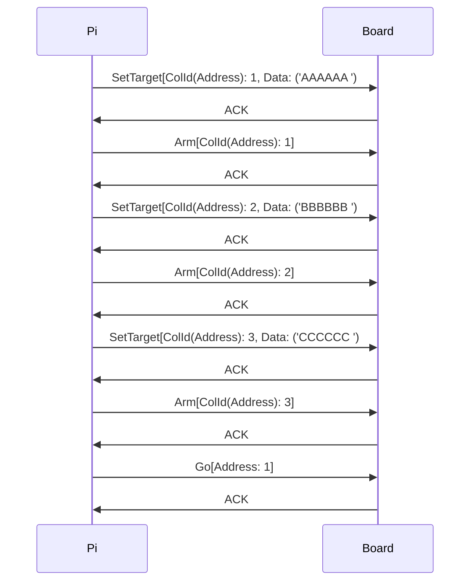

# Protocol (Transport, Layer 1)

The Raspberry Compute Module 3+ communicates with the on-board display/flap-controller using a simple byte-based serial protocol using the on-board serial bus.

## Serial Bus

The serial bus itself is accessible via the `/dev/ttyAMA0` device.
| Setting | Value |
|--|--|
| Baudrate | 38400 Baud In/out |
| Parity | Disabled |
| Stopbit | 1 Stop bit |
| Character Size(bits) | 8 |
| RTS/CTS Hardware flow control | Disabled

# Protocol (Data, Layer 2)

Packets always start with a magic byte (`0xFF`), contain an address, some flags (so far unknown), a payload and its length, and end with a CRC32 of the packet itself.

## Structure
### Packet Structure
| Offset | Length | Field |
|--|--|--|
| 0 | 1 | Magic Byte (0xFF) | 
| 1 | 2 | Address (For most packets the Column ID, 1-22)
| 3 | 1 | Flags
| 4 | 2 | Payload Length
| 6 | variable | \<Payload\>
| 6 + len(payload) | 4 | Checksum(CRC32)

### Payload Structure
| Offset | Length | Field |
|--|--|--|
| 0 | 1 | Packet ID |
| 1 | variable | \<Payload data\>

## Checksum (CRC32)

Before a packet gets sent, the last 4 bytes are set to 0xFF and the whole packet gets checksummed  using CRC32, the result is then stored in the last 4 bytes.

# Packets

## Packet IDs
| Packet ID | Name |
|--|--|
| 0x00 | Unknown/Not used |
| 0x01 | Set Target |
| 0x02 | Arm Column |
| 0x03 | Go |
| 0x04 | Ping |
| 0x05 | Write Register |
| 0x06 | Read Register |

## 0x00 - Unknown

This type is currently not used, or not referenced anywhere

## 0x01 - Set Target

| Offset | Length | Field |
|--|--|--|
| 0 | 1 | Packet ID(0x01) |
| 1 | 7 | Column data as bytes |

### Notes
For some reason there are not 6 but 7 characters in each column, comments in the original firmware might indicate a not-released version of Vestaboard with 7x22 (or even 7x23) flaps.

## 0x02 - Arm Column

| Offset | Length | Field |
|--|--|--|
| 0 | 1 | Packet ID(0x02) |

## 0x03 - Go

| Offset | Length | Field |
|--|--|--|
| 0 | 1 | Packet ID(0x03) |

## 0x04 - Ping

| Offset | Length | Field |
|--|--|--|
| 0 | 1 | Packet ID(0x04) |
| 1 | 2 | Null bytes(0x00 0x00) |

## 0x05 - Write Register

| Offset | Length | Field |
|--|--|--|
| 0 | 1 | Packet ID(0x05) |
| 1 | 1 | Register ID |
| 2 | 2 | Register Value |

## 0x06 - Read Register

| Offset | Length | Field |
|--|--|--|
| 0 | 1 | Packet ID(0x06) |
| 1 | 1 | Register ID | 

# Registers

Coming soon

# Flap Characters

## Colors
| Value | Color |
|--|--|
| 0x00 | Black |
| 0x01 | White |
| 0x02 | Red |
| 0x03 | Orange |
| 0x04 | Yellow |
| 0x05 | Green |
| 0x06 | Blue |
| 0x07 | Purple |

## How to set flaps

The process is simple, after opening a connection to the flap-controller, simply send 1-22 SetTarget packets, followed by 1-22 Arm packets, and commit using a Go packet.

### Note
There has to be a small delay of about 40000μs between each packet, otherwise the board seems to go out-of-sync and sometimes lock up.

### Result

